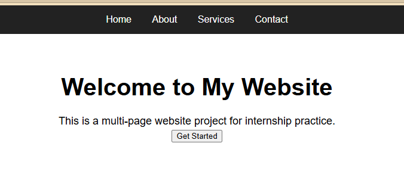
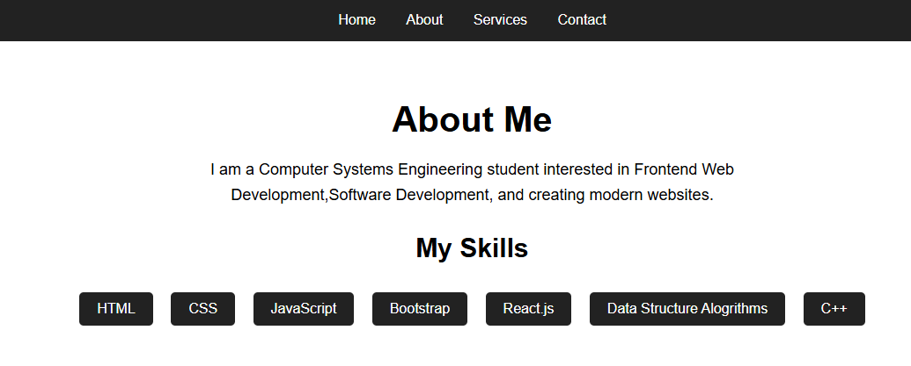
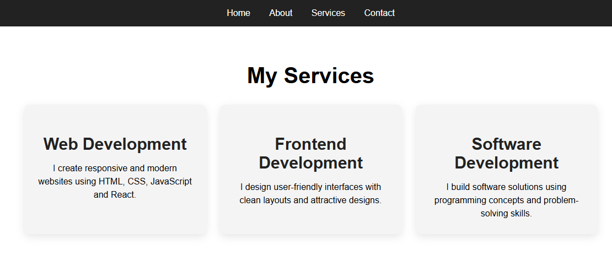
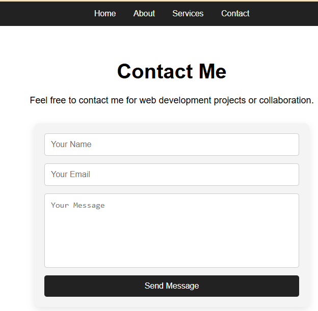

# 🌐 Multi-Page Website Project

**Synent Technologies Internship Task 7 - Multi Page Website (Frontend Development Project)**

A responsive multi-page website built using **HTML, CSS, and JavaScript**.  
The project includes multiple pages, reusable navigation, service cards, and JavaScript form validation.

---

## 📂 Project Structure
multi-page-website/
│
├── index.html
├── about.html
├── services.html
├── contact.html
│
├── style.css
├── script.js
│
└── images/
├── home.png
├── about.png
├── services.png
└── contact.png

## 🚀 Live Features

- 🏠 Home Page with hero section
- 👩‍💻 About Page with skills
- 🛠️ Services Page with cards layout
- 📞 Contact Page with form validation
- 🎯 JavaScript form validation
- 📱 Responsive design (basic)

---

## 🖼️ Project Preview

### 🏠 Home Page

### 👩‍💻 About Page

### 🛠️ Services Page

### 📞 Contact Page

---

## 🛠️ Tech used

- HTML5
- CSS3
- JavaScript (Vanilla)

---

## 🎯 Learning Outcomes

Multi-page website structure
Navigation between pages
CSS styling and layout design
JavaScript form validation
Project organization skills
Responsive UI development

## 👩‍💻 Developer

Sadia Samreen
Computer Systems Engineering Student
Frontend Web Developer

## 📌 Internship Information

Developed for:
Synent Technologies Internship Program

Task:
Task 7 - Multi Page Website (Frontend Development)